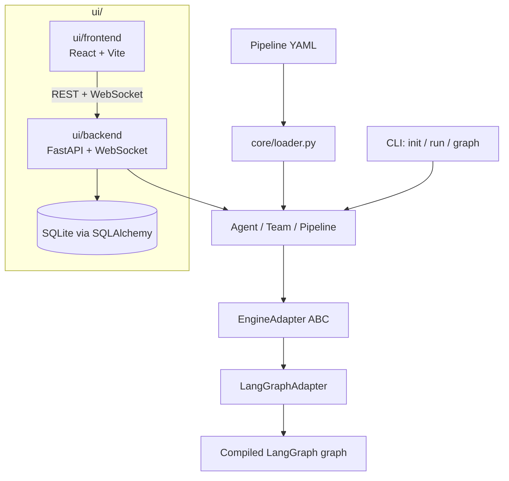

# Architecture overview

A 5-minute orientation for anyone new to this codebase — including a future
Claude session that hasn't read the rest of the project yet. For day-to-day
conventions and commands, see the root `CLAUDE.md`; each area below links to
its own directory-scoped `CLAUDE.md` for full detail.

## Diagram

## Module map

| Area | Responsibility | Details |
|---|---|---|
| `src/bestteam/` | SDK core — `Agent`/`Team`/`Pipeline` dataclasses, `EngineAdapter` ABC, `LangGraphAdapter` | `src/bestteam/CLAUDE.md` |
| `src/bestteam/core/` | `Specification`/`Requirements` structured outputs for the Team Builder, YAML loader, `local_folder`/`vector`/`hybrid` knowledge bases, per-user memory | `src/bestteam/core/CLAUDE.md` |
| `src/bestteam/tools/` | Built-in tools: `web_search`, `local_business_search`, `parse_file`, `http_get`, `calculator`, and the draft-only email toolkit (`email_find`/`email_read`/`email_read_attachment`/`email_draft_reply`) | `src/bestteam/tools/CLAUDE.md` |
| `src/bestteam/cli/` | Typer CLI: `init` / `run` / `graph` | root `CLAUDE.md` |
| `ui/backend/` | FastAPI + WebSocket API — monitoring, builder wizard state machine, config CRUD, auth, model catalog, usage metering, run history/trace persistence, knowledge-base ingestion jobs, anonymous team sharing, autonomous email triggers, per-org email credentials (encrypted secrets store) | `ui/backend/CLAUDE.md` |
| `ui/backend/db/` | SQLAlchemy persistence schema (SQLite; org-scoped multi-tenancy) | `ui/backend/db/CLAUDE.md` |
| `ui/frontend/` | React + TypeScript/Vite customer UI (dashboard, Team Builder wizard, run monitor), admin UI (accounts, config, memory, trace), login, public share chat | `ui/frontend/CLAUDE.md` |

## Tech stack and rationale

| Component | Choice | Why |
|---|---|---|
| Orchestration engine | LangGraph | Graph/state-machine model maps directly onto `Agent`/`Team`/`Pipeline` and the SEQUENTIAL/PARALLEL/HIERARCHICAL collaboration modes. See `DECISIONS.md`. |
| Core abstractions | `langchain-core`, Pydantic v2 | `langchain-core` supplies model specs, tools, and `with_structured_output`; Pydantic v2 backs the `AgentSpec`/`TeamSpec`/`Specification`/`Requirements` schemas. |
| CLI | Typer + Rich | Ergonomic command definitions with good terminal output for `init`/`run`/`graph`. |
| Backend | FastAPI + Uvicorn + WebSocket | REST endpoints plus a streaming channel for live agent trace events to the dashboard. |
| Persistence | SQLAlchemy 2.0 + SQLite | One file-based DB per deployment, no separate database server. Org-scoped multi-tenancy (row-level `org_id`) lets the same code serve a single-customer instance (one org) or a shared platform (many). |
| Default knowledge base | `rank-bm25` | Zero-API-key keyword search; good enough for the common case (a handful to a couple dozen documents). |
| Optional vector knowledge base | `numpy` + an embeddings model | Semantic search (e.g. "refund" matching "money back") when keyword search isn't enough. A `hybrid` type fuses both with Reciprocal Rank Fusion — see `KNOWLEDGE_BASES.md`. |
| Frontend | React 19 + TypeScript + `react-router-dom` 7 + Vite | SPA for the customer surfaces (dashboard, Team Builder wizard, run monitor) and the admin surfaces. |
| Deployment | Docker Compose + nginx | Per-customer container packaging — see `deployment.md`. |
