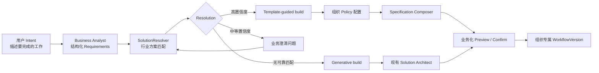
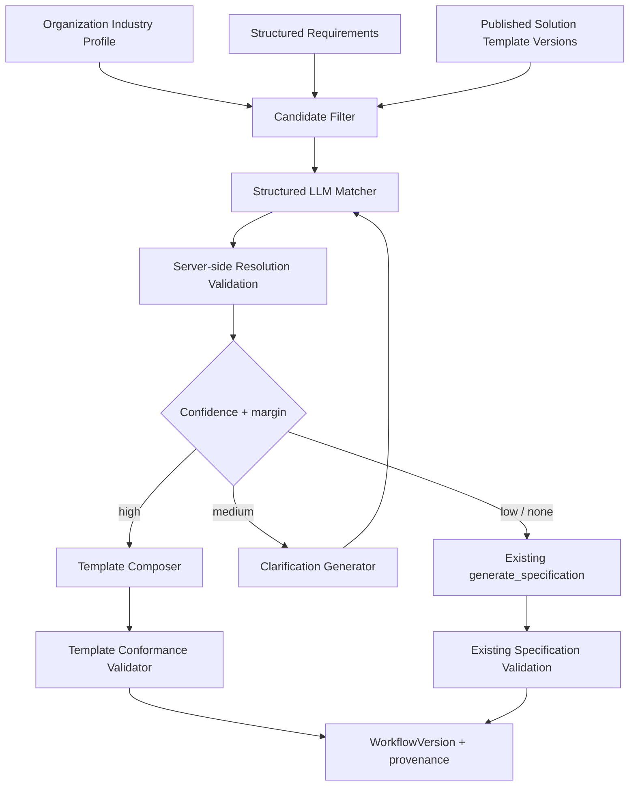

# Intent-driven Industry Solution Resolution — 开发方案

**状态：** Proposed

**日期：** 2026-08-05

**目标读者：** 产品、架构、SDK、后端、前端、QA、试用客户实施团队

**建议版本：** Industry Solution Foundation / Phase 2A

## 1. 结论摘要

最终用户不应该理解或选择 Template、Workflow、Skill、Tool。用户只描述想完成的业务结果，平台负责判断：

1. 当前组织属于什么行业；
2. 用户意图是否匹配已发布的标准行业方案；
3. 是否需要询问一两个业务问题来消除歧义；
4. 应采用标准方案、标准方案加扩展，还是从零生成 AI Team；
5. 标准方案中哪些部分必须锁定，哪些部分需要根据客户政策进行定制；
6. 最终生成哪个组织专属、可测试、可版本化、可审计的 Workflow。

本阶段在现有 Team Builder 的 `requirements` 与 `specification` 之间增加内部 `SolutionResolver`，并建立版本化的 `Industry Solution Template` Catalog。用户界面不增加 “Choose a template” 或 “Use this template”。只有匹配不确定时，系统才用业务语言询问澄清问题。



核心原则：

- **Template 是平台内部蓝图，不是用户需要学习的产品对象。**
- **标准方案优先，生成式设计兜底。**
- **用户确认系统行为和业务边界，不确认内部组件名称。**
- **行业模板只读且版本化；客户只修改自己的配置和 Workflow。**
- **匹配不确定时先澄清，不静默套用错误行业流程。**
- **生产行业方案不依赖 `BESTTEAM_DEMO_WORKFLOWS`。**

## 2. 背景与问题定义

当前平台已经具备：

- Intent/As-is 输入；
- Business Analyst 生成结构化 `Requirements`；
- Solution Architect 从 Skills、Knowledge Bases 和 Model Catalog 生成 `Specification`；
- Preview、Feedback、Testing 和 Deploy；
- 组织级 Workflow 隔离；
- `WorkflowVersion`、`SkillVersion` 和依赖版本固定；
- Property Maintenance Inbox 的 Agents、Skills、邮件 Trigger 和结构化结果能力。

但当前 Solution Architect 每次都主要从空白开始设计。平台即使已经有成熟的 Property Maintenance Inbox 方案，也没有一个正式机制在收到 Intent 后自动发现、加载并约束该方案。

`BESTTEAM_DEMO_WORKFLOWS` 只负责暴露全局 YAML 示例，存在以下限制：

- 默认关闭；
- 所有组织共享可见；
- 多数 Demo 使用 `fake:` 模型；
- 不属于组织，不能直接绑定组织 Email Trigger；
- 没有行业授权、模板安装、客户配置和升级语义；
- 不适合作为生产行业方案 Catalog。

因此需要新增的是“Intent 到行业标准方案”的产品和架构层，而不是继续增加 Demo 开关或要求用户理解 Template。

## 3. 目标与非目标

### 3.1 本阶段目标

- 平台管理员可以定义、发布和废弃版本化行业 Solution Templates；
- 组织具有可用于候选过滤的行业 Profile；
- Requirements 生成后，系统自动匹配适用的行业方案；
- 匹配结果只能引用服务端提供的候选 Template ID；
- 高置信度匹配自动进入 template-guided build；
- 中等置信度匹配最多提出少量业务澄清问题；
- 无匹配时保留当前 generative Solution Architect 路径；
- 从 Template 生成组织专属的 Policy Skill 和 Workflow Specification；
- 平台锁定的安全、Tool 和输出边界不能被组织 Policy 或反馈覆盖；
- 部署后的 `WorkflowVersion` 保存所用 Template Version 和客户配置来源；
- 用户只看到系统将如何工作，不看到 Template 选择器或原始 Workflow JSON；
- Property Maintenance Inbox 成为第一个正式行业 Solution Template；
- 提供离线 Intent 匹配评估和受控灰度机制。

### 3.2 明确非目标

本阶段不包括：

- 面向最终用户的 Solution Marketplace；
- 让用户浏览或比较 Template；
- 自动跨行业使用未授权 Template；
- 根据一次 Intent 自动永久修改组织行业；
- 自动升级所有客户到最新 Template Version；
- 任意 JSON Patch 式的 Template 修改；
- 允许客户覆盖平台安全 Skills；
- 让 LLM 直接写数据库或创建任意 Skill；
- 完整可视化 Template 编辑器；
- Template 收费、订阅和商业授权系统；
- 把 Property Management 业务实体引入平台核心；
- 取代现有 generative Team Builder。

## 4. 术语与对象边界

### 4.1 Industry

平台管理的稳定行业标识，例如：

- `property_management`
- `trades_and_field_services`
- `professional_services`
- `horizontal`，适用于所有行业的横向方案。

最终用户可以用自然语言描述自己的业务。内部必须使用稳定 slug，不能依赖展示名称作为外键。

### 4.2 Solution Template

平台维护的行业标准方案 Head，例如：

```text
property_maintenance_inbox
```

它保存名称、行业、状态和当前发布版本指针，本身不直接执行。

### 4.3 Solution Template Version

不可变的标准方案快照，包含：

- 匹配信息；
- 示例和反例；
- 标准 Workflow Blueprint；
- 必需平台 Skills；
- Policy Schema；
- 锁定规则；
- 连接器要求；
- 用户可理解的行为摘要。

### 4.4 Solution Resolution

一次 Builder Session 对候选方案的匹配结果，包括：

- build mode；
- Template Version；
- 匹配置信度和证据摘要；
- 是否需要澄清；
- 需要采集的 Policy 字段；
- 选择 generic fallback 的原因。

它是 Builder Session 的审计数据，不是用户长期业务实体。

### 4.5 Organization Policy

客户业务习惯和政策，例如办公时间、升级电话、草稿语气和必收字段。Policy 不能改变平台锁定的安全和 Tool 权限。

### 4.6 Deployed Workflow

最终执行单元仍然是现有的组织级 `WorkflowRecord` 和不可变 `WorkflowVersion`。运行引擎不直接执行 Template。

## 5. 用户体验

### 5.1 Intent 输入保持简单

现有 Intent 页面继续询问：

- 想解决什么问题；
- 今天如何处理；
- 可选的访谈转录内容。

不增加以下字段：

- Template 名称；
- Workflow 类型；
- Agent 数量；
- Skill 和 Tool 选择；
- 协作模式。

### 5.2 自动匹配示例

组织行业：`property_management`

用户 Intent：

> 我想自动读取未读邮件并帮我起草回复。

该 Intent 同时可能匹配通用邮件处理、维修邮箱、租客咨询或业主来信。系统不能仅根据组织行业直接套用 Maintenance Inbox。

建议业务化澄清问题：

> 这些邮件主要是什么类型？

选项可以是：

- 租客维修请求；
- 普通租客咨询；
- 业主来信；
- 希望处理整个收件箱；
- 其他。

用户不看到 Template 名称。回答“租客维修请求”后，Resolver 重新评估并选择 `property_maintenance_inbox`。

### 5.3 Template-guided Policy Interview

匹配标准方案后，系统只询问该 Template 的 Policy Schema 中尚未获得的信息，例如：

- 哪些情况必须立即提醒你？
- 紧急联系电话是什么？
- 租客必须提供哪些信息？
- 是否允许为普通维修创建确认草稿？
- 邮件语气和签名是什么？

已能从 Intent、As-is、组织设置或现有 Policy 中可靠获得的答案不重复询问。

### 5.4 Preview 与 Confirm

用户看到：

- AI Team 中有哪些“员工”；
- 每个员工做什么；
- 邮件何时自动处理；
- 哪些动作只生成草稿；
- 哪些情况一定需要人工介入；
- 系统不会做什么；
- 仍缺少哪些连接器或配置。

用户不需要看到：

- `template_id`；
- JSON Blueprint；
- 内部 Skill 名称；
- 匹配 Prompt；
- Tool 函数签名。

可以显示一条弱化来源说明：

> Based on our Property Management best-practice setup.

### 5.5 Feedback

用户反馈分为两类：

1. **Policy 范围内：** 更新结构化 Policy Answers，重新合成 Policy Skill 和 Specification；
2. **结构性变化：** 进入 `template_plus_extension`，由 Solution Architect 在标准 Blueprint 外增加允许的能力。

第一版可以只完整支持 Policy 范围内修改。超出范围时向用户说明需要重新设计，并转入现有 generative 路径或管理员评审，不能让模型静默破坏锁定规则。

## 6. 目标架构



建议新增以下模块：

- `src/bestteam/core/solution_resolution.py`
  - Pydantic Resolution schemas；
  - Matcher Prompt；
  - 不依赖数据库的匹配调用；
- `ui/backend/solution_templates.py`
  - Template Catalog repository；
  - 候选过滤；
  - 平台管理 API；
- `ui/backend/solution_resolver.py`
  - 组织上下文组装；
  - Matcher 调用；
  - 服务端验证和置信度路由；
- `ui/backend/template_composer.py`
  - Policy 答案验证；
  - 组织 Policy Skill 合成；
  - Blueprint 到 Specification 的确定性组合；
  - conformance validation；
- 现有 `ui/backend/builder.py`
  - Requirements 后调用 Resolver；
  - clarification 和 template-guided Specification 路径；
  - Deploy 时保存 provenance。

## 7. 数据模型

### 7.1 Organization Industry Profile

第一版建议在 `organizations` 增加：

| 字段 | 类型 | 说明 |
|---|---|---|
| `industry_slug` | Nullable String | 组织当前主要行业 |
| `industry_source` | Nullable String | `operator` / `onboarding` / `inferred_confirmed` |
| `industry_confirmed_at` | Nullable DateTime | 用户或管理员确认时间 |

不要根据一次 Intent 自动永久写入 `industry_slug`。如果组织行业为空，可以推断候选，但在作为长期组织属性保存前需要确认。

若未来确认一个组织需要多个行业，可迁移为 `organization_industries` 关联表。Phase 2A 先支持一个主要行业，避免提前引入多行业授权复杂度。

### 7.2 `solution_templates`

| 字段 | 类型 | 说明 |
|---|---|---|
| `id` | Integer PK | 稳定 Head ID |
| `slug` | Unique String | 稳定内部名称 |
| `display_name` | String | 平台管理员可读名称 |
| `industry_slug` | String | 行业或 `horizontal` |
| `status` | String | `draft` / `published` / `deprecated` |
| `current_version_id` | Nullable FK | 当前发布版本 |
| `operator_disabled` | Boolean, default False | Kill switch：与 `status` 独立，运营可以不改变 publish 生命周期、瞬间让一个已发布 Template 停止被候选过滤命中 |
| `created_at` | DateTime | 创建时间 |
| `updated_at` | DateTime | 更新时间 |

平台 Template 不带 `org_id`，因为它是平台资产。只有平台管理员可以写入。

### 7.3 `solution_template_versions`

| 字段 | 类型 | 说明 |
|---|---|---|
| `id` | Integer PK | 版本 ID |
| `template_id` | FK | Template Head |
| `version_number` | Integer | 单调递增 |
| `matching_profile` | JSON | capabilities/examples/negative examples |
| `workflow_blueprint` | JSON | 标准 Specification Blueprint |
| `policy_schema` | JSON | 客户配置字段 |
| `guardrails` | JSON | 锁定规则和行为边界 |
| `required_connectors` | JSON | 如 `imap` |
| `behavior_summary` | JSON | 用户 Preview 内容 |
| `created_by` | Nullable String | 发布人 |
| `created_at` | DateTime | 发布时间 |

唯一约束：`(template_id, version_number)`。

版本发布后不可修改。编辑 Template 必须创建新 Version。

### 7.4 Builder Session 扩展

在 `builder_sessions` 增加：

| 字段 | 类型 | 说明 |
|---|---|---|
| `build_mode` | Nullable String | `template_guided` / `template_plus_extension` / `generative` |
| `solution_template_version_id` | Nullable FK | 选中的不可变版本 |
| `solution_resolution_json` | Nullable JSON | 匹配结果和 clarification 状态，`status` 取值见下 |
| `template_answers_json` | Nullable JSON | 结构化 Policy Answers |
| `resolution_seq` | Integer, default 0 | 乐观并发计数器，见 §16.2 |

保持现有六阶段 `status` 不变：

```text
intent → requirements → spec → solution → testing → deployed
```

澄清属于 `requirements` 阶段内的子状态，保存在 `solution_resolution_json.status`，避免破坏现有 resume 和路由逻辑。

> **术语澄清（实现前必读）：** 现有 `status == "solution"` 与
> `POST /api/builder/sessions/{session_id}/solution`（`ui/backend/builder.py:479`
> `submit_solution_feedback`）指的是既有的"Stage 4 Specification 反馈/精修"阶段，
> 与本方案的 `SolutionResolver` / `Solution Template` / `Solution Resolution`
> 是两个无关概念，只是恰好共享中英文"方案/solution"这个词。本方案新增的匹配
> Endpoint 已刻意使用不同路径名 `resolve-solution`（§12.1），代码实现中所有新
> 标识符也必须显式带 `solution_resolution` / `solution_template` 前缀（不能单独
> 用裸的 `solution`），避免与既有 Stage 4 代码路径混淆。此外，`template_guided`
> Session 的 Policy-only 反馈（§5.5 第一类）最终也会经过既有的
> `submit_solution_feedback` 入口，因此 WP6 除了 `/specification` 也需要改造这个
> 既有端点，让 `build_mode == template_guided` 时调用 Template Composer 而不是
> `generate_specification`。

> **`solution_resolution_json.status` 取值（评审补充）：** 三个值，与
> `build_mode` 的写入时机严格对应：
>
> | `status` | 含义 | 此时 `build_mode` |
> |---|---|---|
> | `needs_clarification` | Matcher 要求澄清，等待用户回答后重新 resolve | 仍为 NULL |
> | `resolved` | 匹配到具体 Template，走 template-guided | `template_guided` |
> | `generative_fallback` | 无可靠匹配或匹配失败安全回退 | `generative` |
>
> Matcher 原始输出的 `mode` 字段（§9.2，四值 `Literal` 含
> `template_plus_extension`）不能直接原样写入 `status`——`template_plus_extension`
> 已被 §9.3 降级为 `generative`（决策 #5），对应写入 `status="generative_fallback"`；
> Matcher 返回 `needs_clarification` 时原样写入 `status="needs_clarification"`
> 且 `build_mode` 保持 NULL，直到澄清完成后重新 resolve 产出 `resolved` 或
> `generative_fallback` 才写 `build_mode`。

> **并发 resolve 控制（评审补充，配合 §16.2）：** `resolution_seq` 每次
> `resolve-solution` 请求开始时先原子 `+1` 并读回新值（`UPDATE ... SET
> resolution_seq = resolution_seq + 1 RETURNING resolution_seq`），请求处理完
> 成后写回 `solution_resolution_json`/`build_mode` 前，必须在同一事务里确认
> `resolution_seq` 仍等于自己持有的值（`WHERE resolution_seq = :my_seq`）；不
> 匹配说明期间有更新的请求已经写入，本次写入直接丢弃（no-op），前端据此提示
> "结果已更新，请刷新"而不是覆盖用户后来的答案。

### 7.5 Workflow Version Provenance

在 `workflow_versions` 增加：

| 字段 | 类型 | 说明 |
|---|---|---|
| `solution_template_version_id` | Nullable FK | generative Workflow 为 NULL |
| `template_customization` | Nullable JSON | 已验证、最小化的 Policy 配置快照 |
| `build_mode` | Nullable String | 部署时的构建模式 |

Run 已引用精确 `WorkflowVersion`，因此可以从 Run 追溯到 Template Version，不需要让 Runtime 直接解析 Template。

### 7.6 第一版不增加 Template Installation 表

在当前产品中，一个部署结果已经由 `BuilderSession → WorkflowRecord → WorkflowVersion` 表达。Phase 2A 先使用上述 provenance 字段，避免创建第二套生命周期对象。

如果后续需要独立的升级状态、许可、暂停和多个 Workflow 组合，再增加 `solution_installations`。

## 8. Solution Template Contract

建议 Template Version 的内部结构：

```json
{
  "matching_profile": {
    "supported_capabilities": [
      "read_incoming_email",
      "classify_property_maintenance",
      "extract_maintenance_details",
      "draft_tenant_reply"
    ],
    "positive_examples": [
      "Automatically triage tenant maintenance emails",
      "Read repair requests and draft responses"
    ],
    "negative_examples": [
      "Process rental applications",
      "Reply to every email in the company inbox",
      "Prepare owner financial statements"
    ],
    "keywords": [
      "maintenance",
      "repair",
      "tenant",
      "leak"
    ]
  },
  "workflow_blueprint": {
    "agents": [],
    "teams": [],
    "workflow": {"steps": []}
  },
  "policy_schema": {
    "fields": []
  },
  "guardrails": {
    "required_skills": [],
    "forbidden_tools": [],
    "locked_agent_tools": {},
    "locked_team_modes": {},
    "required_behavior_flags": []
  },
  "required_connectors": ["imap"],
  "behavior_summary": {
    "does": [],
    "does_not": [],
    "human_review": []
  }
}
```

Template 内容必须在发布时通过：

- Pydantic schema；
- 现有 `Specification` 验证；
- Skill/Tool 依赖解析；
- 每个 Agent 的固定 `spec` 字符串在当前 Model Catalog 中有效（§10.2，不是抽象
  Model Slot 解析）；
- guardrail 一致性验证；
- 行业和 slug 检查。

## 9. Matcher 与 Resolver

### 9.1 候选预过滤

服务端先过滤候选，LLM 不能看到整个跨行业 Catalog。

候选必须满足：

- `status == published`；
- `industry_slug == organization.industry_slug`，或为 `horizontal`；
- 当前 Template Version 有效；
- Template 未被 operator kill switch 禁用。

> Release 2A.1 不引入独立的组织级 entitlement/订阅系统（§24 决策 #8）：
> "组织是否有权使用"完全由上面的行业匹配条件决定，不存在额外的授权检查。
> 商业化/entitlement 是独立的后续产品决策。

缺少连接器不应直接移除候选。它可能意味着“匹配，但部署前需要连接邮箱”。

若组织行业未知：

- 可以同时评估 `horizontal` 和少量行业推断候选；
- 不能永久更新组织行业；
- 匹配行业方案前需要用户用业务语言确认业务类型。

### 9.2 Structured Matcher Output

建议 Pydantic 模型：

```python
class SolutionResolution(BaseModel):
    mode: Literal["template_guided", "template_plus_extension", "generative", "needs_clarification"]
    template_id: int | None
    confidence: float
    matched_capabilities: list[str]
    missing_capabilities: list[str]
    evidence_summary: list[str]
    clarification_questions: list[ClarificationQuestion]
```

不要保存或返回 chain-of-thought。`evidence_summary` 只保存简短、可审计的业务证据，例如“Intent 明确提到 tenant maintenance emails”。

### 9.3 服务端验证

Matcher 返回后必须验证：

- `template_id` 在本次候选列表中；
- Template Version 仍然是有效已发布版本；
- Template 行业适用于当前组织；
- confidence 位于 `[0, 1]`；
- clarification 数量和文本长度受限；
- 不能包含任意 HTML、链接或内部 Prompt；
- 没有候选时 `template_id` 必须为 NULL；
- 匹配失败安全回退到 generative，不产生 500；
- **`mode == "template_plus_extension"` 在 Release 2A.1/2A.2 一律拒绝**：
  Matcher 的 Pydantic schema（§9.2）技术上允许模型返回这个值，但 §24 决策 #5
  已明确该 build mode 不进入首个 Release。服务端验证必须把 Matcher 自报的
  `template_plus_extension` 视为不支持的模式，**降级为 `generative`**（而不是
  静默当作 `template_guided` 处理——模型选它说明它认为匹配的 Template 覆盖不了
  全部需求，如果服务端强行套用纯 Policy 定制，等于用一个已知覆盖不全的模板糊弄
  用户，比直接走 generative 更危险），并把这一步计入 §16.4 审计的
  "失败类别"。§12.2 中"`build_mode == template_plus_extension`"的 Specification
  Endpoint 分支是为未来 Release 预留的架构占位，2A.1/2A.2 不会有 Session 真正
  进入该分支。

### 9.4 置信度路由

初始建议：

- 高置信度：`confidence >= 0.85` 且第一候选比第二候选至少高 `0.15`；
- 中等置信度：`0.55 <= confidence < 0.85`，或候选差距不足；
- 低置信度：`confidence < 0.55`，进入 generative；
- 高风险歧义：无论分数都要求澄清。

这些阈值必须配置化，并通过离线 Intent 数据集校准。LLM 的自报 confidence 不能视为统计概率，只能作为受评估的路由信号。

> **候选数为 1 时的 margin 规则（评审补充）：** Release 2A.1/2A.2 只发布
> `property_maintenance_inbox` 一个 Template，尚无 `horizontal` Template（§17
> WP3），因此候选集合大小为 1 是主线场景，不是边界情况——"第一候选比第二候选
> 至少高 0.15" 在这种情况下必须有明确定义，不能留给实现者猜。规则：**只有一个
> 候选时，第二候选置信度按 `0` 处理**，margin 条件恒成立，路由只看
> `confidence >= 0.85` 这一个条件。候选数为 0 时已由 §9.3"没有候选时
> `template_id` 必须为 NULL"覆盖，直接进入 generative。

### 9.5 澄清策略

- 一轮最多 1–2 个问题；
- 优先询问能区分前两名候选的问题；
- 使用业务语言和业务选项；
- 不提 Template 名称；
- 最多两轮；
- 两轮后仍不确定时进入 generative 或人工/高级配置路径；
- 用户回答追加到 Requirements/Resolution Context，不覆盖原 Intent。

## 10. Template-guided Specification Composition

### 10.1 不使用自由生成重写 Blueprint

匹配 Template 后，第一版使用确定性 Composer：

1. 加载固定的 Template Version；
2. 校验 Policy Answers；
3. 为 Preview/Test 确定性生成 Session 内的临时 Policy `SkillSpec`；
4. 将该 Skill 的明确名称加入允许的 Agent；
5. 根据 Model Catalog 填充 Blueprint 的模型槽位；
6. 生成组织专属名称和 friendly descriptions；
7. 运行 conformance validator；
8. 运行现有 `validate_specification`；
9. 保存到 `BuilderSession.specification_json`。

LLM 可以帮助从自然语言答案提取结构化 Policy，但不能自由改变 Agent/Tool/Skill 边界。

### 10.2 Model Slots

**已确认（决策 #6，见 §24）：Release 2A.1 不实现抽象 Model Slot 的运行时解析。**
当前代码库中不存在任何"按角色/能力解析模型"的机制——`ui/backend/db/model_catalog.py`
只是一个 flat 的 `spec → 定价/tier` 目录，现有 generative Solution Architect
也只是把该目录渲染成 Prompt 文本，由模型直接挑一个具体 `spec` 字符串
（`builder.py::_with_model_catalog`）。为一个只有一个 Template 的首个 Release
构建通用的 Slot 解析引擎，属于本文档 CLAUDE.md 强调的"不需要的灵活性"。

**Blueprint 的 JSON Contract 不包含 `model_slot` 或任何等价的占位字段。** 早期
草稿曾建议保留一个未使用的 `model_slot` 字段"仅作为未来扩展的占位符"，但这与
本节前一段刚引用的"不需要的灵活性"论证自相矛盾——一个当前代码不读、不写、
没有校验规则的 schema 字段就是投机性配置，字段本身廉价不是保留它的理由。
JSON 字段随时可以在真正需要时新增，不需要迁移，因此没有理由提前占位。实际
做法：

1. 发布 `property_maintenance_inbox` Template Version（WP3）时，管理员为
   Blueprint 中每个 Agent 直接填入一个已在当前 Model Catalog 中存在的具体
   `spec` 字符串（例如 `openai:gpt-4.1-mini`），与现有 `crud.py`
   `PUT /workflows/{name}` 校验 Agent 模型的方式一致
   （`deploy_validation.validate_agent_models`）。
2. Composer（WP6）把该固定 `spec` 写入生成的 Specification，并在
   `WorkflowVersion.template_customization`/`build_mode` provenance
   中记录"该次部署使用的是 Template Version 发布时固定的模型"。
3. 只有当第二个 Template 出现、且确实需要跨 Template 共享同一个可替换
   角色时，才重新评估是否要实现真正的 Slot 解析——那时是一个独立的、
   有真实需求驱动的设计决策，而不是提前泛化。

### 10.3 Organization Policy Skill

建议 Skill 名称使用稳定、不可冲突的内部格式，**延续**
`docs/superpowers/specs/2026-08-02-property-maintenance-inbox-phase-1-development-plan.md`
§8.2 已经采用、并已写进已发布 YAML 注释的
`<org_slug>_maintenance_policy_v1` 风格（下划线分隔 + `_v1` 版本后缀），只是把
写死的 `maintenance` 换成通用的 `template_slug`，不引入新的双下划线分隔符：

```text
<org_slug>_<template_slug>_policy_v1
```

> **评审补充（命名一致性）：** 原稿的 `org_<org_id>__<template_slug>__policy`
> 与 Release 1A 已经在 `ui/backend/workflows/property_maintenance_inbox_demo.yaml`
> 头部注释里指导实施者手工创建的 `<org_slug>_maintenance_policy_v1` 是两套不
> 兼容的命名规则。若不统一，一个已经通过旧的 Advanced Skills CRUD 手工建过
> Policy Skill 的试用组织，第一次跑新的 template-guided 流程时会得到第二个、
> 名字不同但用途重复的 Policy Skill，造成困惑。因此改为对齐并泛化已发布的
> 命名风格，而不是另起一套。`org_id` 在这里不是必需的：`Organization` 目前
> 没有可变更 name 的 Admin 接口（`admin_api.py` 的 `PATCH /orgs/{name}` 只做
> 启用/停用），Skill 名称本身也已经通过 `(org_id, name)` 唯一约束天然按组织
> 隔离，用 `org_slug` 和现有约定保持一致即可。WP6 实现时，如果目标组织已经
> 存在字面量为 `<org_slug>_maintenance_policy_v1` 的 Skill（Release 1A 手工
> 流程遗留），首次为该组织的 `property_maintenance_inbox` 做 template-guided
> 合成时应把它的内容作为新 `<org_slug>_property_maintenance_inbox_policy_v1`
> 的初始素材来源之一，而不是无视它、静默新建一个功能重叠的 Skill。

每次 Policy 更新都通过现有 Skill Version 机制追加不可变版本。Workflow 发布时继续使用现有 `WorkflowDependency` 固定精确 SkillVersion。

Preview 和 Test 阶段不立即创建持久化 `SkillRecord`，而是从 `template_answers_json` 现场渲染临时 `SkillSpec`，通过现有 `extra_skills` 构建路径注入。Deploy 时才在同一事务内：

1. 创建或更新该组织的 Policy `SkillRecord`；
2. 追加不可变 `SkillVersion`；
3. 发布 `WorkflowVersion`；
4. 写入精确 `WorkflowDependency`；
5. 更新 BuilderSession 的 workflow 指针。

任何一步失败都整体回滚，避免被放弃的 Builder Session 在 Skills Library 中留下孤儿 Policy Skill。

Policy 指令使用确定性 renderer 生成，客户文本始终放入清晰的数据边界中。禁止客户 Policy 覆盖：

- draft-only；
- Tool allowlist；
- Prompt injection 防护；
- UID scope；
- 必须人工处理的风险；
- 输出 Contract；
- 禁止承诺规则。

### 10.4 Conformance Validator

`validate_template_conformance(template_version, spec)` 至少检查：

- 必需 Agent 存在；
- Agent 使用的 Tool 不超出允许集合；
- 必需平台 Skills 存在且未被组织同名 Skill shadow；
- Team mode 和 Agent 顺序符合锁定规则；
- 禁止 Tool 不存在；
- 邮件发送 Tool 不存在；
- 所需输出 Contract 标记存在；
- 组织 Policy Skill 只挂载到允许 Agent；
- 连接器需求已记录；
- Specification 可以由现有 loader 构建。

平台锁定 Skill 建议通过 stable resource ID/SkillVersion 解析，而不是仅靠名称，避免组织同名 Skill 意外替换安全规则。

### 10.5 Locked Skill Version Binding

Template Version 发布时，应把每个锁定平台 Skill 解析并记录为具体 `SkillVersion.id`，不能只保存名称。Template-guided Deploy 需要扩展现有发布 primitive，使其接受经过验证的 dependency bindings：

```text
agent skill name → exact platform SkillVersion ID
organization policy skill name → exact org SkillVersion ID
```

`publish_workflow_version` 写 `WorkflowDependency` 时优先使用这些显式 bindings，而不是再次执行“组织同名 Skill 优先”的普通名称解析。Runtime 已经按 WorkflowVersion 的依赖快照加载 Skill，因此部署后继续沿用现有版本固定机制。

Generative Workflow 保持现有名称解析行为；只有 Template 锁定依赖需要显式绑定。

> **已核实：** `WorkflowDependency`（`ui/backend/db/models.py`，`id,
> workflow_version_id, resource_kind, resource_name, resource_id,
> resource_version_id`，唯一约束 `(workflow_version_id, resource_kind,
> resource_name)`）已经原生支持"资源名 → 精确 SkillVersion id"的绑定，本节
> 不需要新表或新列。但 `record_version_dependencies`（`ui/backend/db/dependencies.py:61-63`，
> 签名 `(db, *, version_id, org_id, raw)`）目前没有 bindings 参数：它总是从
> `raw["agents"][*]["skills"]` 里的名称出发，用
> `SkillRecord.name.in_(skill_names)` 按名称查库解析 `resource_id`/
> `resource_version_id`（同文件 76-88 行），没有任何入口可以传入一个预先解析好
> 的 `SkillVersion.id` 让它跳过按名称解析。WP6 必须**扩展这个函数签名**（或新增
> 一个接受显式 bindings 的姊妹函数），让 Template-guided 部署路径可以传入
> `{skill_name: locked_skill_version_id}` 并直接写入 `resource_version_id`，
> 跳过按名称解析——这与前一段"需要扩展现有发布 primitive"的结论一致，不是
> "零代码改动"。

### 10.6 Policy Schema 字段类型（决策 #7，见 §24）

`policy_schema.fields` 第一版只支持四种控件，覆盖 §11 Property Maintenance
Inbox 列出的所有 Policy 字段（办公时间、紧急电话、语气、分类规则等）：

| 类型 | 说明 | 校验 |
|---|---|---|
| `text` | 单行/多行自由文本 | 长度上限（建议 500 字符），去除 HTML |
| `select` | 单选，固定选项列表 | 值必须在 `options` 中 |
| `multi_select` | 多选，固定选项列表 | 每个值必须在 `options` 中，去重 |
| `boolean` | 开关 | `true`/`false` |

不支持富文本、文件上传、嵌套/条件字段（"回答 A 才出现字段 B"）。这些留给
`template_plus_extension` 或后续 Release，避免第一版校验和 UI 复杂度失控。

## 11. Property Maintenance Inbox 首个正式 Template

当前 `property_maintenance_inbox_demo.yaml` 继续保留为开发 Fixture。新增正式数据库 Template Version，内容基于现有 Release 1A：

- Industry：`property_management`；
- Maintenance Intake Analyst（`role:` 精确匹配已发布的
  `property_maintenance_inbox_demo.yaml`，不是简写的 "Intake Analyst"）；
- Maintenance Response Coordinator（同上，精确匹配 "Response Coordinator"
  会与已发布 role 不一致）；
- `SEQUENTIAL`；
- 平台 Skills：
  - `email_input_security_core_v1`
  - `property_maintenance_intake_v1`
  - `property_maintenance_response_v1`
- Required Connector：`imap`；
- Output Contract：`property_maintenance_email_batch`；
- Action Boundary：draft-only；
- Policy Schema：办公时间、紧急电话、必收字段、语气、签名和分类规则；
- Positive/Negative Intent Examples；
- 用户行为摘要。

正式 Template 必须通过平台 seed/migration 或管理员发布进入 Template Catalog，不依赖：

```text
BESTTEAM_DEMO_WORKFLOWS=1
```

## 12. Builder API 调整

### 12.1 新增 Resolution Endpoint

建议：

```http
POST /api/builder/sessions/{session_id}/resolve-solution
```

请求：

```json
{
  "model": "openai:...",
  "answers": {
    "mail_type": "tenant_maintenance"
  }
}
```

返回现有 session payload，并增加：

```json
{
  "build_mode": "template_guided",
  "solution_resolution": {
    "status": "resolved",
    "confidence": 0.94,
    "clarification_questions": []
  },
  "policy_questions": []
}
```

最终用户 API 不返回完整 Template Blueprint、Guardrails 或跨行业候选信息。

### 12.2 Specification Endpoint

现有：

```http
POST /api/builder/sessions/{session_id}/specification
```

调整为：

- `build_mode == template_guided`：调用 Template Composer；
- `build_mode == template_plus_extension`：**Release 2A.1/2A.2 中此分支不可达**——
  §9.3 服务端验证已把 Matcher 自报的 `template_plus_extension` 降级为
  `generative`，`build_mode` 永远不会被写成这个值（见决策 #5，§24）。这里列出
  只是为未来 Release 预留的架构占位，实现 WP6 时不需要真的写"先 compose 再由
  受限 Architect 扩展"的逻辑；
- `build_mode == generative`：保持当前 `generate_specification`；
- resolution 未完成时拒绝直接进入 template-guided specification；
- 管理员/测试直接提交 Specification 的现有路径保持兼容。

### 12.3 Policy Answers Endpoint

可以合并进 Resolution Endpoint，或新增：

```http
PUT /api/builder/sessions/{session_id}/template-answers
```

第一版建议合并，减少 Wizard 往返和状态组合。后端仍应把 Resolution Answers 与 Policy Answers 分开存储。

### 12.4 Platform Admin API

**Release 2A.1 范围**（WP3 的 seed 脚本必须通过这些端点完成 dogfooding，不允许绕过
API 直接写库——否则这套 API 在 2A.1 里没有任何真实调用方）：

```http
GET    /api/config/solution-templates
POST   /api/config/solution-templates
GET    /api/config/solution-templates/{slug}
PUT    /api/config/solution-templates/{slug}/draft
POST   /api/config/solution-templates/{slug}/publish
PATCH  /api/config/solution-templates/{slug}/kill-switch
```

`kill-switch` 写 §7.2 新增的 `operator_disabled` 字段，与 publish 生命周期无关。

**推迟到 Release 2A.3**（与 WP8 Admin UI 一起交付——决策 #9 已明确 WP8 排在
2A.2 之后，见 §24，2A.1/2A.2 都没有第二个 Version 或真实废弃场景可以练习）：

```http
POST   /api/config/solution-templates/{slug}/deprecate
GET    /api/config/solution-templates/{slug}/versions
```

第一版可以只提供 JSON CRUD 和发布操作，不需要图形 Template Builder。

## 13. Frontend 调整

### 13.1 Intent Page

当前 Intent Page 自动执行：

```text
create session → requirements → specification → preview
```

调整为：

```text
create session → requirements → resolve-solution
    ├─ resolved/generative → specification → preview
    └─ needs_clarification → 显示业务问题 → resolve again
```

Loading labels 使用用户语言，例如：

- Understanding your business goal…
- Checking the best way to build your team…
- Tailoring the team to your business…
- Designing your AI team…

不显示 “Matching template”。

### 13.2 Clarification Card

新增组件建议：

```text
ui/frontend/src/components/SolutionClarification.jsx
```

支持：

- 单选；
- 多选；
- 短文本；
- 必填校验；
- 一次提交；
- 恢复未完成 Session；
- API 错误保留用户答案。

问题和选项必须来自服务端校验后的结构，不直接渲染任意 HTML。

### 13.3 Preview / Confirm

增加：

- `What this team will do`；
- `What it will never do automatically`；
- `When you will be asked to review`；
- `Connections needed before launch`；
- 可选行业最佳实践说明。

不展示 Template ID 和 confidence。

### 13.4 Platform Advanced Page

增加管理员专用 `Solution templates` Tab：

- 查看 Head、行业、状态和当前版本；
- 编辑 Draft JSON；
- 验证；
- 发布新 Version；
- 查看历史版本；
- 废弃但不删除已被 WorkflowVersion 引用的版本。

## 14. 行业隔离与权限

### 14.1 候选隔离

- Org user 永远不能请求“列出所有 Templates”；
- Resolver 候选由服务端按行业过滤；
- LLM 只接收过滤后的候选摘要；
- 返回的 `template_id` 必须属于候选集合；
- 未授权或跨行业 ID 统一按无效匹配处理，不泄露 Template 是否存在。

### 14.2 修改隔离

- 平台 Template 只有 platform admin 可以修改；
- 组织只写自己的 BuilderSession、Policy Skill 和 Workflow；
- Template Version 不带 `org_id`，但所有生成结果都必须带当前 `org_id`；
- 客户反馈不能写回 Template；
- 两个组织从同一 Template 生成完全独立的 Workflow/Skill Versions。

### 14.3 跨行业需求

如果 Property Management 组织明确提出一个 Tradies 方案：

- 不静默加载 `trades_and_field_services` Template；
- 询问该需求是其自身业务的一部分还是不同业务；
- 由管理员或用户确认组织行业扩展后才能使用；
- 在 Phase 2A 单行业模型下，可以进入 generative 路径，而不是越权使用跨行业模板。

## 15. Template Version 与升级

### 15.1 发布

- Template Draft 可变；
- Publish 创建新不可变 Version；
- Head `current_version_id` 指向最新发布版；
- 已部署 Workflow 继续引用原 Template Version；
- 删除 Head 不得级联删除历史 Version；优先使用 deprecate。

> **与现有 Skill/Workflow admin CRUD 的差异（评审补充）：** `ui/backend/CLAUDE.md`
> 记录的现有约定是"save is deploy"——Skill 的每次 PUT 直接追加不可变 Version，
> Workflow 的每次 PUT 直接写 `status="deployed"`，都没有单独的 draft 阶段。
> Template 在这里刻意采用不同的两阶段（draft 可变 + 显式 publish）模式，原因
> 是爆炸半径不同：一次 Skill/Workflow 保存只影响发起这次保存的那一个组织；
> 一次 Template 保存如果直接生效，会立刻改变**所有**正在匹配该行业的组织看到
> 的候选结果——半成品或有错字的 Draft 一旦"save is deploy"就是平台级事故，而
> 不是单组织事故。两阶段模式让管理员可以反复编辑、校验 Draft，只有确认无误后
> 才用一次显式 Publish 把爆炸半径从"平台"变成"这一个已验证的不可变 Version"。

### 15.2 新建 Team

Resolver 默认使用当前已发布版本，并把精确 ID 写入 BuilderSession。即使管理员之后发布 v2，该 Session 继续使用原 v1，除非重新解析或用户明确重新开始。

### 15.3 已部署 Team

Phase 2A 不自动升级。未来可以显示：

```text
An improved setup is available.
```

升级必须：

- 在沙盒中重新 compose；
- 保留可兼容 Policy Answers；
- 显示业务行为差异；
- 发布新的 WorkflowVersion；
- 保留旧版本和 Run provenance。

## 16. 安全与可靠性

### 16.1 Intent 是不可信输入

- Intent、As-is、访谈转录和澄清答案都作为数据；
- Matcher Prompt 使用明确边界；
- 限制输入长度；
- 不允许用户文本改变候选列表；
- 不允许 Intent 要求读取平台 Template 指令；
- 不返回隐藏 Template 内容。

### 16.2 Matcher 失败

- 模型超时、格式错误或未知 ID：安全回退到 generative，或提示重试；
- 不产生半写入 Template 选择；
- Resolution 保存必须事务化；
- 同一 Session 并发 resolve 使用 `builder_sessions.resolution_seq` 做乐观并发
  控制（字段定义和 CAS 规则见 §7.4），避免旧响应覆盖新答案。

### 16.3 Composer 失败

- 不持久化无效 Specification；
- Policy Skill 与 BuilderSession 更新在同一事务边界内，或使用补偿删除；
- conformance failure 记录安全诊断，不向用户返回内部 Prompt；
- Deploy 再次验证 conformance，不能只相信 Specification 阶段。

### 16.4 审计

至少记录：

- Session；
- Organization；
- Requirements 版本；
- 候选 Template IDs；
- 最终 build mode；
- Template Version；
- clarification 轮数；
- WorkflowVersion；
- Policy SkillVersion；
- Resolver 模型和用量；
- 失败类别。

不记录模型 chain-of-thought。

## 17. 开发工作包

### WP0 — Intent 数据集与 Template Contract

**负责人：** Product + Architecture + Implementation + QA

交付：

- Property Management Intent 数据集；
- 正例、反例、歧义例和跨行业例；
- `property_maintenance_inbox` Template Contract 草案（matching_profile/
  workflow_blueprint/guardrails 等 §8 结构的具体内容，Policy Schema 字段类型
  规范本身已由 §10.6 统一定义，此处只是套用该规范填出 Property Maintenance
  的具体字段——WP3 负责把这份草案落地为真正 published 的 DB Template Version）；
- 初始匹配和澄清验收标准。

建议至少包含：

- 50 个明确维修 Intent；
- 50 个物业管理但非维修 Intent；
- 30 个通用邮件 Intent；
- 20 个恶意或越权 Intent；
- 20 个短、口语化、语音转录质量差的 Intent。

### WP1 — 数据模型与迁移

**主要位置：**

- `ui/backend/db/models.py`
- `alembic/versions/`
- `tests/test_migrations.py`

交付：

- Organization industry 字段；
- SolutionTemplate；
- SolutionTemplateVersion；
- BuilderSession resolution/template 字段；
- WorkflowVersion provenance 字段；
- guarded/idempotent migration；
- FK、唯一约束和索引。

### WP2 — Template Repository 与 Platform Admin API

**主要位置：**

- 新增 `ui/backend/solution_templates.py`
- `ui/backend/crud.py`
- `ui/backend/main.py`
- `ui/backend/auth_api.py`

交付（Release 2A.1 范围，见 §12.4）：

- Head CRUD；
- Draft validate；
- immutable publish；
- kill switch 开关（`operator_disabled`）；
- candidate query；
- platform-admin-only 权限；
- 被引用版本的删除保护。

推迟到 2A.3（与 WP8 一起，见决策 #9）：version history、deprecate。

### WP3 — Property Maintenance 正式 Template Seed

**依赖：** WP1（`solution_templates`/`solution_template_versions` 表必须先存在，
见 §18 依赖修正）、WP2（seed 脚本通过 Admin API 完成，见 §12.4）。

**主要位置：**

- 新增 Template seed 脚本（调用 WP2 的 Admin API：create → draft → publish，
  不绕过 API 直接写库）；
- 复用 `ui/backend/skills.py`；
- 保留现有 Demo YAML。

交付：

- 第一个 published Template Version；
- Blueprint；
- matcher examples/negative examples；
- Property Maintenance 场景下具体填充的 Policy Schema 内容（字段类型规范本身
  已由 §10.6/WP0 的 Template Contract 统一定义，WP3 只产出这一个 Template 的
  实际字段值，不重新设计 schema 格式）；
- Guardrails；
- Behavior Summary（同上，格式由 WP0 Contract 定义，内容由 WP3 填充）；
- seed 幂等性测试。

### WP4 — Core Resolution Schema 与 Matcher

**主要位置：**

- 新增 `src/bestteam/core/solution_resolution.py`
- `src/bestteam/__init__.py`
- 新增 core tests。

交付：

- Pydantic schemas；
- structured-output matcher；
- Prompt boundary；
- clarification schema；
- model capability errors；
- bounded fields；
- 无 DB 的确定性测试接口。

### WP5 — Backend SolutionResolver 与 Builder 集成

**主要位置：**

- 新增 `ui/backend/solution_resolver.py`
- `ui/backend/builder.py`
- `ui/backend/db/builder_sessions.py`

交付：

- industry/candidate filtering；
- `resolve-solution` endpoint；
- confidence/margin routing；
- clarification loop；
- generative fallback；
- Session persistence/resume；
- resolver usage metering。

### WP6 — Template Composer、Policy Skill 与 Conformance

**主要位置：**

- 新增 `ui/backend/template_composer.py`
- `ui/backend/skills.py`
- `ui/backend/db/dependencies.py`（`record_version_dependencies` 定义于此，需要
  扩展签名以接受显式 bindings，`db/workflows.py` 只是调用方——见 §10.5）
- `ui/backend/builder.py`：`POST /{id}/specification`（`submit_specification`）
  与 `POST /{id}/solution`（`submit_solution_feedback`，见 §7.4 术语澄清）
  两个既有端点都要在 `build_mode == template_guided` 时改走 Composer。

交付：

- Policy validation/renderer；
- Preview/Test 临时 Policy SkillSpec；
- Deploy-time org Policy Skill 与 WorkflowVersion 原子 publishing；
- 固定模型 spec 写入 Specification（不做抽象 Slot 解析，见 §10.2 决策 #6）；
- Specification composition；
- conformance validator；
- locked platform SkillVersion dependency bindings（复用现有
  `WorkflowDependency` 表结构，扩展 `record_version_dependencies` 接受显式
  bindings，见 §10.5）；
- Deploy-time revalidation；
- WorkflowVersion provenance。

### WP7 — Intent、Clarification、Preview UI

**主要位置：**

- `ui/frontend/src/pages/wizard/IntentPage.jsx`
- 新增 `ui/frontend/src/components/SolutionClarification.jsx`
- `ui/frontend/src/pages/wizard/PreviewPage.jsx`
- `ui/frontend/src/pages/wizard/ConfirmPage.jsx`
- `ui/frontend/src/lib/api.js`

交付：

- 新的自动 resolution 调用链；
- clarification UI；
- session resume；
- behavior/guardrail Preview；
- loading/error/重试状态；
- 无 Template 术语的文案。

### WP8 — Advanced Template 管理与诊断

**主要位置：**

- `ui/frontend/src/pages/AdvancedPage.jsx`
- 新增管理员 Template 组件；
- 管理 API client。

交付：

- Platform admin Template 列表；
- Draft JSON 编辑和验证；
- Publish/deprecate；
- 版本历史；
- Resolver 诊断视图，仅管理员可见；
- 不向 Org user 暴露 Catalog。

### WP9 — 评估、灰度与文档

交付：

- 离线 Intent evaluation runner；
- shadow-mode 指标；
- pilot feature flag；
- operator runbook；
- Template authoring guide；
- rollback guide；
- `docs/STATUS.md`、`docs/DECISIONS.md` 和各目录 `AGENTS.md` 更新。

## 18. 建议实施顺序

```text
WP0 Contract / Intent Dataset
  ├─> WP1 Data Model
  └─> WP4 Resolution Schema

WP1
  └─> WP2 Template Repository/API
        └─> WP3 First Template Content

WP2 + WP4
  └─> WP5 SolutionResolver/Builder
        └─> WP6 Composer/Conformance
              └─> WP7 Customer UI
              └─> WP8 Admin UI

WP3 + WP5 + WP6 + WP7
  └─> WP9 Evaluation / Shadow / Pilot
```

> **评审修正（第一轮）：** 原图把 WP2（Template Repository/Admin API）挂在
> WP4（Resolution Schema）之下，但 WP2 的交付物（Head CRUD、Draft validate、
> 发布、候选查询、Admin 鉴权）不消费 Matcher/Resolution schema，只需要 WP1 的
> 表存在即可开工；真正需要 WP4（Matcher 调用、Pydantic schema）的是 WP5。按
> 原图排期会不必要地阻塞 WP2，或误导团队以为 WP2 依赖 WP4。
>
> **评审修正（第二轮）：** 原图把 WP3（Template Seed）挂在 WP0 下面，与 WP1
> 并列，暗示两者可并行开工。但 WP3 的种子脚本要写入的
> `solution_templates`/`solution_template_versions` 表由 WP1 的迁移创建，且
> §12.4 已改为要求 WP3 通过 WP2 的 Admin API（create → draft → publish）完成
> seed，不能绕过 API 直接写库——因此 WP3 实际依赖 WP1 **和** WP2，不是 WP0 的
> 平行分支。

建议 Release 划分：

### Release 2A.1 — Backend Foundation

- 数据模型；
- Template API；
- Resolver；
- Property Maintenance Template seed；
- generative fallback；
- 后端测试；
- 无最终用户 UI 变化，可用 API 验证。

### Release 2A.2 — Guided Customer Flow

- Intent 自动 resolution；
- clarification UI；
- Template Composer；
- Policy Skill；
- Preview 行为说明；
- Workflow provenance。

### Release 2A.3 — Controlled Rollout

- shadow mode；
- 离线阈值校准；
- 试用组织启用；
- 管理诊断；
- 指标和回滚。

## 19. 测试方案

### 19.1 数据模型与版本测试

- Template slug 唯一；
- `(template_id, version_number)` 唯一；
- published Version 不可修改；
- deprecate 不影响历史 WorkflowVersion；
- WorkflowVersion provenance 固定；
- BuilderSession 跨组织不可访问；
- migration 从现有数据库安全升级；
- `create_all` 后 migration 仍安全。

### 19.2 Resolver 单元测试

- 当前行业 + 明确维修 Intent → Maintenance Template；
- 当前行业 + 所有邮件 Intent → 不错误匹配 Maintenance；
- `operator_disabled == true` 的 Template 不出现在候选列表（kill switch）；
- 模糊邮件 Intent → clarification；
- 非维修物业 Intent → negative example 生效；
- 无候选 → generative；
- LLM 返回未知 Template ID → 拒绝；
- LLM 返回跨行业 ID → 拒绝；
- 无效 confidence/超长字段 → 拒绝或截断；
- matcher timeout → fallback；
- 第一/第二候选差距不足 → clarification；
- 两轮仍不确定 → generative；
- Intent prompt injection → 候选集合不变。

### 19.3 Composer 与 Conformance 测试

- Blueprint 生成正确两 Agent 顺序；
- Intake 无 draft Tool；
- Response 无 read/find Tool；
- 所需平台 Skills 固定到正确 SkillVersion；
- 组织同名 Skill 不能 shadow 锁定安全 Skill；
- Policy 答案生成组织 Skill；
- 不同组织生成不同 Skill/Workflow；
- Policy 不能增加 send Tool；
- Feedback 不能删除 emergency human-review；
- 无连接器时可 Preview，但 Deploy 被现有检查阻止；
- invalid Policy 不产生半写入记录；
- Deploy 再次验证 conformance。

### 19.4 Builder API 集成测试

- create → requirements → resolve → specification → deploy；
- high confidence 无用户额外点击；
- medium confidence 返回业务问题；
- answers 后继续自动生成；
- low confidence 使用现有 Solution Architect；
- Session 刷新后恢复 clarification；
- 重复 resolve 幂等；
- 旧 resolve 响应不能覆盖新答案；
- 已选 Template 发布新版本后 Session 仍固定旧版本；
- 直接提交 Specification 的兼容路径不回归。

### 19.5 前端测试

- Intent 高置信度自动进入 Preview；
- clarification 单选/多选/短文本；
- 用户不看到 Template、Skill、Tool 技术术语；
- API 失败保留答案；
- 刷新后恢复；
- Preview 显示 does/does-not/human-review；
- generative 路径行为不变；
- org user 不能进入 Advanced Template 管理；
- platform admin 可以发布新 Version。

### 19.6 安全与隔离测试

- Org A 不能读取 Org B 的 Resolution/Policy/Workflow；
- Org user 不能列出 Platform Template Catalog；
- Property Management Resolver 看不到 Tradies candidates；
- 伪造 Template ID 失败；
- Prompt injection 不能请求隐藏 Blueprint；
- Template API 只有 platform admin 可写；
- deprecated Template 不用于新 Session；
- `operator_disabled` Template 不用于新 Session，即使 `status == published`；
- 历史 Run 仍可追溯 deprecated Version；
- Policy 文本不能改变 Tool 权限。

## 20. 离线评估与指标

### 20.1 Resolver 指标

- Top-1 Template accuracy；
- 维修 Template precision/recall；
- 需要澄清的 Intent 比例；
- 澄清后准确率；
- generative fallback 比例；
- 跨行业误匹配数；
- 用户纠正率；
- 从 Intent 到 Preview 的时间和模型成本。

对标准方案匹配应优先保证 precision。错误套用一个行业流程通常比进入 generative fallback 更危险。

### 20.2 产品指标

- 用户完成 Intent 后到部署的步骤数；
- 平均澄清问题数；
- Preview 后大幅结构调整率；
- Template-guided Team 测试通过率；
- 部署后首个成功自动 Run；
- Policy 字段被后续修改的频率；
- 标准方案升级意愿和回滚率。

### 20.3 Shadow Mode

第一阶段先保持用户体验不变：

- 现有 generative Builder 正常工作；
- Resolver 在后台计算推荐但不改变 Specification；
- 平台管理员查看推荐、confidence 和人工标签；
- 达到阈值后才开启 template-guided build。

Shadow 数据不得包含未最小化的敏感 Intent 副本；BuilderSession 已有原 Intent 时只保存引用和匹配摘要。

## 21. Feature Flags 与回滚

建议增加独立开关，不复用 `BESTTEAM_DEMO_WORKFLOWS`：

```text
BESTTEAM_SOLUTION_RESOLVER_MODE=off|shadow|enabled
BESTTEAM_SOLUTION_RESOLVER_PILOT_ORGS=<comma-separated org slugs, optional>
```

行为：

- `off`：完全使用当前 generative Builder；
- `shadow`：计算并记录，不改变用户流程；
- `enabled`：允许 template-guided 和 clarification 路径。若同时设置了
  `PILOT_ORGS`，只有列表中的组织实际获得 `enabled` 行为，其余组织继续走
  `shadow`；不设置 `PILOT_ORGS` 时 `enabled` 对所有组织生效——这一个变量同时
  服务 §17 WP9 的"pilot feature flag"和 §18 Release 2A.3 的"试用组织启用"，
  不是两套独立机制。

> **评审补充（去掉冗余的行业开关）：** 原稿还有一个
> `BESTTEAM_SOLUTION_RESOLVER_INDUSTRIES=property_management` 独立开关，用来
> 限制生效行业。但决策 #2（§24）已经把 Release 2A.1-2A.3 限定为只发布一个
> 行业的一个 Template，行业范围已经完全由"哪些 Template 被 `published`"决定
> （§9.1 候选过滤），再加一个环境变量重复限制同一件事，属于 CLAUDE.md
> "不需要的灵活性"——真正需要按行业细粒度灰度时（多个行业都已发布 Template），
> 再引入这个维度是一个有真实需求驱动的独立决策，不提前加。

回滚到 `off` 不删除已有 Workflow、Template Version 或 provenance。已经部署的组织 Workflow 继续运行。

## 22. Definition of Done

Phase 2A 完成必须满足：

1. 用户不需要浏览或选择 Template；
2. 用户提交简单 Intent 后，系统在 Requirements 后自动执行行业方案匹配；
3. 明确的 Property Maintenance Intent 能自动采用正式 Maintenance Template；
4. “处理所有未读邮件”这类歧义 Intent 不会被静默当成维修流程；
5. 不确定时只询问少量业务问题，不暴露内部 Template 名称；
6. 无匹配或 Resolver 故障时现有 generative Builder 仍可工作；
7. Resolver 不能选择服务端候选列表之外的 Template；
8. 不同组织和不同行业的候选、Policy、Workflow 完全隔离；
9. Template Version 发布后不可变；
10. 组织只能修改 Policy 和允许的 customization slots；
11. 平台安全 Skills、Tool allowlist 和输出 Contract 不能被覆盖；
12. 部署结果是组织自己的 WorkflowVersion，不直接执行共享 Template；
13. WorkflowVersion 保存 Template Version、build mode 和最小配置 provenance；
14. Property Maintenance 正式 Template 不依赖 Demo Workflow 开关；
15. Preview 用业务语言展示 does/does-not/human-review；
16. Shadow evaluation 达到 §24 决策 #4 约定的门槛（Property Maintenance Top-1
    precision ≥ 0.90、零跨行业误匹配、"本应无歧义却要求澄清"比例 < 15%）才能把
    `BESTTEAM_SOLUTION_RESOLVER_MODE` 从 `shadow` 切到 `enabled`；
17. 后端全量测试、前端测试、lint 和 build 通过；
18. 有 operator authoring、发布、灰度和回滚 Runbook。

## 23. 主要风险与缓解

| 风险 | 影响 | 缓解 |
|---|---|---|
| 仅凭行业错误套用 Template | 生成不适合的业务流程 | positive/negative examples、margin、澄清、precision-first |
| LLM 自报 confidence 不可靠 | 路由阈值失真 | 离线校准、候选差距、shadow mode、用户纠正指标 |
| Template 与客户需求差距大 | 用户频繁推翻设计 | Policy Schema、template-plus-extension、generative fallback |
| 客户 Policy 覆盖安全规则 | 越权或危险行为 | 确定性 renderer、locked Skill IDs、conformance validator |
| Template 更新影响现有客户 | 行为漂移 | immutable versions、WorkflowVersion pinning、无自动升级 |
| 跨行业 Template 泄露 | 商业和安全隔离问题 | 服务端候选过滤、无 org catalog endpoint、ID membership validation |
| Template Catalog 成为第二套 Runtime | 架构重复 | Template 只负责 build-time；Runtime 仍执行 WorkflowVersion |
| Builder 状态机复杂化 | resume 和前端回归 | clarification 作为 requirements 子状态，不增加顶级 status |
| Policy Skill 大量生成 | 资源和管理噪声 | 每组织/Template 使用稳定 Head，更新追加 SkillVersion |
| Demo 与生产 Template 混淆 | 错误部署 fake 模型 | 独立表和 API，Demo 开关不参与 Resolver |

## 24. 决策确认（原"开放决策"，已在本次评审中逐条确定）

原文档留了 10 个开放问题并给出一份"保守选择"清单，但清单只覆盖了其中 5 项，
另外 4 项（#1、#4、#6、#7）没有给出可执行的具体结论。第 10 项虽然也没有被
那份清单覆盖，但它的答案其实已经隐含在 §9.1 未改动过的候选过滤规则里——不是
真正悬而未决，只是从没有人把它写成一句明确的话；本次一并写清楚，避免读者
误以为它和 #1/#4/#6/#7 一样是新拍板的决策。本次评审逐条补齐，Release 2A.1
按以下结论实施，不再视为开放问题：

1. **组织行业来源** — Onboarding 时问一次简单的行业 picklist（含"暂不确定"
   选项，`industry_source="onboarding"`）；Platform Admin 可随时在
   Advanced 组织管理里覆盖（`industry_source="operator"`）；Resolver 的
   clarification 流程在组织没有 `industry_slug` 时，可以把用户对"这是什么类型
   业务"的显式确认回答保存为组织行业（`industry_source="inferred_confirmed"`），
   但只能来自一次用户看得到、需要确认的动作，绝不能从一次 Intent 静默推断后
   直接落库——这与 §7.1 已有的护栏一致，这里只是把"谁、什么时候写"钉死。
2. **Phase 2A 是否只支持一个主要行业** — 是，`organizations.industry_slug`
   为单值列，不引入 `organization_industries` 关联表；见 §7.1。
3. **Resolver 模型** — 复用用户为 Requirements 阶段选择的
   structured-output 模型，不引入独立的 Resolver 专属模型配置。理由：
   `generate_requirements`/`generate_specification` 已经是
   `model.with_structured_output(PydanticModel)` 这一套机制
   （`src/bestteam/core/requirements.py:75`、
   `src/bestteam/core/specification.py:257`——分别是各自函数体内实际调用
   `with_structured_output` 的那一行，函数定义本身在 65/239 行），Matcher
   遵循同一模式最省心；
   独立模型选择留给以后真的出现"匹配质量需要比生成质量更强模型"的证据时再加。
4. **Confidence 阈值和候选 margin** — 使用 §9.4 已给出的初始值（高置信度
   `confidence ≥ 0.85` 且领先第二名 `≥ 0.15`；中等置信度
   `0.55 ≤ confidence < 0.85` 或差距不足；低置信度 `< 0.55`）作为
   config-driven 的起始值，WP0/WP9 的离线数据集据此校准，Release 2A.3
   开放试用前必须重新核对。Shadow-mode 转正门槛（DoD #16）：Property
   Maintenance Top-1 precision ≥ 0.90、跨行业误匹配为 0、"本应无歧义却被
   要求澄清"的比例 < 15%，缺一不可——precision 优先于召回，宁可多问，不可
   错配。
5. **`template_plus_extension` 是否进入首个 Release** — 不进入。Release
   2A.1/2A.2 只完整支持 `template_guided` 的 Policy-only 定制；超出 Policy
   Schema 的反馈按 §5.5 "第一版可以只完整支持 Policy 范围内修改" 转入
   generative 路径或管理员评审。
6. **Model Slot 固定时机** — 见新增 §10.2：Release 2A.1 不实现抽象 Slot
   解析，Template Version 发布时直接固定具体 `spec` 字符串。
7. **Policy Schema 第一版控件** — 见新增 §10.6：`text` / `select` /
   `multi_select` / `boolean` 四种，不支持富文本、文件、条件字段。
8. **Platform Template 商业 entitlement** — Release 2A.1 不引入
   entitlement/订阅系统，候选过滤只按 `industry_slug` 匹配 + `status ==
   published` + kill switch（§9.1）。商业化是独立的后续产品决策。
9. **管理员 Template UI 是否进入 2A.1** — 不进入。2A.1 只提供 §12.4 的
   JSON CRUD/发布 API 和 WP3 的 seed 脚本；图形化 Advanced 页面 Tab（WP8）
   排在 2A.2 之后，与 §18 建议实施顺序一致。
10. **横向方案是否与一个垂直行业同时生效** — 是，且这早已是 §9.1 候选过滤
    规则本身隐含的行为（`industry_slug == organization.industry_slug` 或
    `horizontal`）：组织仍然只有一个主要行业（决策 #2），但 Resolver 的候选
    集合永远同时包含该行业模板和所有 `horizontal` 模板——"多行业候选"和
    "组织拥有多个行业"是两件不同的事，这里只確定前者恒定生效。

## 25. 文档交付

实现完成时更新：

- `docs/STATUS.md`；
- `docs/DECISIONS.md`；
- `docs/team_builder_methodology.md`；
- `ui/backend/AGENTS.md`；
- `ui/backend/db/AGENTS.md`；
- `ui/frontend/AGENTS.md`；
- Template Authoring Guide；
- Solution Resolver Evaluation Guide；
- Operator rollout/rollback Runbook；
- Property Maintenance Template 行为和 Policy 字段说明。

---

本阶段的成功标准不是“系统可以保存 Template”，而是：**一个不理解 AI 架构的行业用户只需要描述想完成的工作，平台就能优先复用成熟行业方案，在必要时询问少量业务问题，并生成一个安全、隔离、可定制、可追溯的组织专属 AI Team。**
